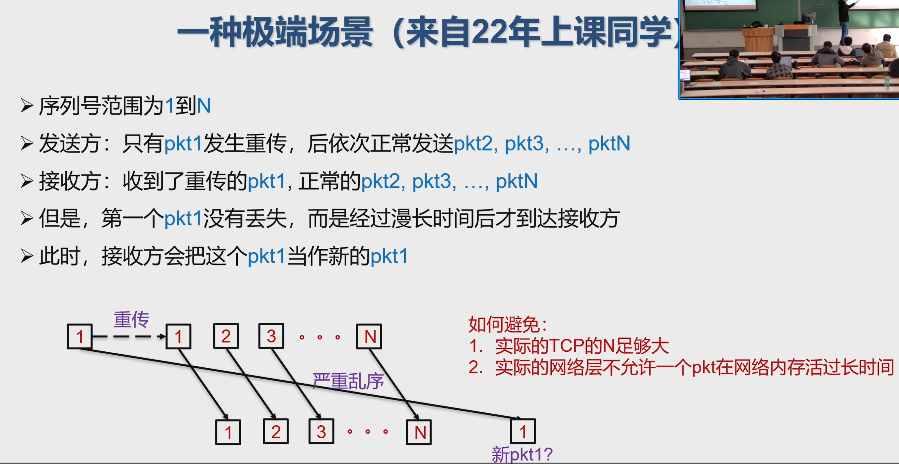

传输层需求

可靠传输
聊天工具、支付要求传输数据100%到达
有些应用(如语音对话)可以容忍一定数据丢失

低时延

有些应用(如在线游戏，电话会议) 对延迟极端敏感

高吞吐
有些应用(如视频播放)有最低带宽要求，以保证服务质量
其他应用根据实际分配得到的带宽进行传输

安全

数据加密、数据完整性 

传输层的接口

基于网络层提供的服务，向不同主机上的应用程序提供通信服务

从网络的角度:屏蔽应用复杂性

按照因特网的“端到端”设计原则: 网络设计不需要考虑应用程序

站在应用程序的角度:屏蔽底层网络的复杂性

应用程序只运行在终端上，即不需要为网络设备编写

传输层应提供进程之间通信的抽象: 即运行在不同终端上的应用进程仿佛是直接连在一起的

Internet的网络层提供“尽力而为”的服务

网络层不提供任何承诺

不保证交付成功、按序交付、数据完整、延迟、带宽等

传输层的有所为、有所不为
传输层可以通过差错恢复、重排序等手段提供可靠、按序的交付服务
但传输层无法提供延迟保证、带宽保证等服务

Mainly UDP, TCP

port number: client usually auto allocate, servers usually specify one.

分用：

UDP套接字使用<IP地址,端口号>二元组进行标识

TCP: listen socket + connection socket

- 服务器在收到客户的连接请求后，创建一个连接套接字，但使用原监听端口号。
- 连接socket需要使用<source IP地址，目的IP地址，源port，目的port>四元组进行标识，服务器使用该四元组将TCP报文段交付到正确的连接套接字

UDP: 以报文为单位进行传输，应用可以感知报文边界 (because data may come from different things)
TCP: 字节流传输，应用感知不到报文边界 (a connection for a meeting)

# Protocol

## UDP

### 报文结构

UDP checksum:

发送方:
将报文段看成是由16比特整数组成序列，对其计算校验和（加起来取反，以让接收方求和得到0xFFFF），放到UDP报文checksum字段

接收方

对收到的报文段进行相同的计算

与收到的checksum字段进行比较，不相等就有误，相等未必无误。

计算UDP校验和时，要包括伪头、UDP头和数据三个部分

计算校验和时，checksum字段项填0

UDP伪头信息取自IP报头，包括:

- 源IP地址，目的IP地址
- UDP的协议号
- UDP报文段总长度

包含伪头信息，是为了避免由于IP地址错误等造成的误投递

缓冲区在协议中没有规定，一般由端系统实现。

Linux:有接收缓冲（每个socket一个）没有发送缓冲区

reliable transport

可靠传输:保证数据在不可靠信道上**完整、正确、有序**地从源到目的进行传送

# 10.23 Common Reliability Solution

自动重传请求 (ARQ, Automatic Repeat reQuest): 基于反馈的重传

- 三要素: (接收方) 差错检测、 (接收方) feedback、 (发送方) 重传

三个问题：出错、丢包、乱序

先考虑出错

rdt2.0是最简单的ARQ协议

发送方：发送一个数据包后暂停，等待ACK或NAK到达后发送下一个包

接收方
若检测数据包有错，返回NAK
否则，完成接收后，回复ACK

ACK与NAK的内容是不重要的: dummy frame

此类协议又称停-等式协议 (stop-and-wait)：发送1个报文后就停下，等待后再发

问题: 如果ACK或NAK出错

检测出ACK或NAK有错后，发送方不知道接收方的状况

1. 发送方通知接收方重传ACK或NAK
   缺陷:通知本身也可能出错，陷入死循环
2. 采用更复杂的校验技术，不仅可以检测差错，还能纠正差错
   缺陷:额外的计算与传输开销
3. 发送方直接重传
   缺陷: 接收方收到多份数据

rdt2.1 采用上述3

发送方
在数据包中加上序号Seq，区分不同数据包
接收方
忽略序号重复的数据包

rdt 2.2:在ACK中加上最近成功接收的seq

发送方就可以判断最近发送是否成功 (通过比较ACK的seg与自己的seq)

NAK就不再需要：当ACK出错或ACK.seg != seg，发送方进行重传

有错+丢包：加个timer 没有确认的话就重发。rdt3.0

效率的评估
F = 数据大小(bits),R =信道发送速率(bits/second),I= 信道传播延迟(不考虑接发送端与收端处理延迟、接收端发送ACK延迟)
数据发送时间(Time to transmit a single frame) = F/R
往返延迟 RTT =2I
停止-等待 协议的发送工作时间是F/R，空闲时间是RTT
信道利用率(line utilization)=F/(F+R·RTT)
当 F<RTT 时:信道利用率<50%

长肥网络(LFN，Long Fat Network): 如果一个网络的带宽-延迟乘积(bandwidth-delay product) 较高 (>10^5 bits，约12 kB)，则可以被认为是长肥网络

## Optimization

### Pipeline

1. 增大序号的范围

   每一个等待确认的数据包都需要一个唯一的seq; seq被确认后可以复用

2. 发送方需保存所有未被确认的数据包

3. 处理多个数据包的丢失、损坏、超长延迟

三要素:差错检测、反馈、重传

根据“反馈+重传”的不同，有2种方法: 回退N步 (Go-back-N，GBN)、选择重传 (Selective Repeat, SR)

sliding window 限制最多有N个未确认数据包

### 回退N 

(Go Back N，简称GBN) :
发送方最多可以有N个未确认数据
接收方对多个连续数据包进行**累计确认**，非连续数据包暂时不确认
发送方维护1个计数器，对当前最古老数据包计时(从该数据包成为最古老包开始计)，计数器到期时，重传所有未确认数据包。

- 错误或乱序：忽略
- 不缓存数据包，即使是未收到过的
- 重发**已收到的最大seq**作为ACK

less load on receiver

### SR

设计思想：接收方对每个数据包独立确认

若发送方发出连续的若干包后，收到对其中某一包的ACK错误，或某一包的定时器超时，则只重传该出错包或计时器超时的数据

要点

- 发送端需要对每个包维护计数器
- 接收端需要缓存已经接收的数据包，以便按顺序交付给上一层

为什么在$[rcvbase-N,rcvbase-1]$中间要确认？前面的ack可能已丢失，sender还不知道你收到了。比这个还远的，窗口已经过了。 

复用seq对选择重传的影响

解决方案:窗口大小不能超过seq取值空间的一半 

证明：

上图就是极端情况，考虑此

那回退n呢？seq 范围窗口大小+1 极限情况同SR

## TCP

### 可靠传输

TCP在不可靠的IP服务上建立可靠的数据传输

- 可能报文出错(但可以校验) 、丢包、乱序
- 基本机制:流水线传输
  发送端:流水线式发送数据、等待确认、超时重传
  接收端:进行差错检测、确认接收
- 对字节建立序号，而非报文
  ACK值为**下一个期望的字节序号**，而非当前已经收到的最后一个字节
  ACK值放在正常数据包里(捎带，piggyback)
- 乱序处理:协议没有明确规定实现方式
  接收端不缓存:可以正常工作，处理简单，但效率低
  接收端缓存:效率高，但处理复杂

发送方：

- 定时器的使用：仅对最早未确认的报文段使用一个重传定时器（与GBN类似）
- 重发策略：仅在超时后重发最早未确认的报文段（与SR类似，因为接收端缓存了失序的报文段）

接收方：
- 确认方式：采用累积确认，仅在正确、按序收到报文段后，更新确认序号；其余情况，重复前一次的确认序号（与GBN类似）
- 失序报文段处理：缓存失序的报文段（与SR类似）

只使用一个定时器且只重发第一个未确认报文，避免了超时设置过小时重发大量报文段

利用流水式发送和累积确认，可以避免重发某些丢失了ACK的报文段

瞬时RTT和平均RTT有很大的偏差

需要在EstimtedRTT 上加一个“安全距离”，作为超时值

安全距离的大小与RTT的波动幅度有关 detail refer to ppt or web

TCP确认的二义性问题
重传的TCP报文段使用与原报文段相同的序号
发送端收到确认后，无法得知是对哪个报文段进行的确认

二义性确认带来的问题

- 对重传报文段测量的SampleRTT，可能不准确

  

解决方法
忽略有二义性的确认，只对一次发送成功的报文段测量SampleRTT，并更新EstimtedRTT
当TCP重传一个段时，停止测量SampleRTT

- 简单忽略重传报文段的问题：
- 重传意味着超时值可能偏小了，需要增大
- 若简单忽略重传报文段（不更新EstimtedRTT），则超时值也不会更新，超时设置过小的问题没有解决
- 解决方法：
- 采用定时器补偿策略，发送方每重传一个报文段，就直接将超时值增大一倍（不依赖于RTT的更新）
- 若连续发生超时事件，超时值呈指数增长（至一个设定的上限值）

Karn算法

仅靠超时重发丢失的报文段恢复太慢!
发送方可利用重复ACK检测
报文段丢失:
发送方通常连续发送许多报文段
若仅有个别报文段丢失，发送方将收到多个重复序号的ACK
多数情况下IP按序交付分组
重复ACK极有可能因丢包产生

快速重传: 在定时器到期前重发丢失的报文段

TCP协议规定:

当发送方收到对同一序号的3次重复确认时，立即重发包含该序号的报文段

Receiver:

为减小通信量，TCP允许接收端推迟确认:接收端可以在收到若千个报文段后，发送一个累积确认的报文段 (类似GBN)

推迟确认带来的问题:
·若延迟太大，会导致不必要的重传
·推迟确认造成RTT估计不准确
TCP协议规定
推迟确认的时间最多为500ms
接收方至少每隔一个报文段使用正常方式进行确认

### 连接管理

发送序号:

数据载荷中第一个字节在字节流中的序号

确认序号:

期望接收的下一个字节的序号

在网络中，2次握手总是可行的吗?
在一个不可靠的网络中，总会有一些意外发生
包传输延迟变化很大
存在重传的报文段
存在报文重排序

失败的根本原因:客户端确认”服务器在线”，但服务器没有确认“客户端也在线

为什么起始序号不从0开始
若在不同的时间、在同一对socket之间建立了连接，则新、旧连接上的序号有重叠，旧连接上重传的的报文段
会被误以为是新连接上的报文段

可以随机选取起始序号吗?

若在不同的时间、在同一对套接字之间建立了连接，且新、旧连接上选择的起始序号x和y相差不大
那么新、旧连接上传输的序号仍然可能重叠

结论: 必须避免新、旧连接上的序号产生重叠

可以基于时钟选取

客户端、服务器都可以主动关闭连接
通过在TCP segment中设置FINbit = 1

FIN消息需要被确认

一旦发送FIN，就不能再发送数据，只能接收数据

一旦收到对方的FIN之后，知道对方不再发送消息，可以在己方数据发送完后安全关闭

四次握手过程:
2端各自发送FIN，也各自确认对方的FIN
优化:
FIN与ACK可以一起发送

TCP实现的问题
服务器在收到SYN段后，发SYNACK段，分配资源
若未收到ACK段，服务器超时后重发SYNACK段
服务器等待一段时间(称SYN超时)后丢弃未完成的连接
SYN超时的典型值为30秒~120秒

SYN洪泛攻击:
攻击者采用伪造的源IP地址
向服务器发送大量的SYN段
却不发送ACK段

服务器为维护一个巨大的半连接表耗尽资源，导致无法处理正常客户的连接请求，表现为服务器停止服务

TCP端口扫描的原理
扫描程序依次与目标机器的各个端口进行TCP通信
根据获得的响应来收集目标机器信息

SYN扫描:发送端向目标端口发送
SYN报文段
若收到SYNACK段，表明目标端口上有服务在运行
若收到RST段，表明目标端口上没有服务在运行
若什么也没收到，表明路径上有防火墙，有些防火墙会丢弃来自外网的SYN报文段

FIN扫描:试图绕过防火墙，发送端向目标端口发送FIN报文段
若收到ACK=1、RST=1的TCP段，表明目标端口上没有服务在监听

若没有响应，表明有服务在监听 (RFC973的规定)
有些系统的实现不符合RFC 973规定，如在Microsoft的TCP实现中，总是返回ACK=1、RST=1的TCP段

### 流量控制

发送端TCP通过调节发送速率，不使接收端缓存溢出

观察接受方发送的rcvWindow（buffer大小 - 已占用的）

当接收窗口变为非0时，接收方应通告增大的接收窗口

TCP协议规定:

发送方收到“零窗口通告”后，可以发送“零窗口探测”报文段

从而接收方可以发送包含接收窗口的响应报文段

Persistent Timer: when timeout, send ask post

If receive 0 window post still, restart.

But this is inefficient.

糊涂窗口综合症
当数据的发送速度很快而消费速度很慢时
接收方不断发送微小窗口通告
发送方不断发送很小的数据分组
大量带宽被浪费

接收方 Clark策略
通告零窗口之后，仅当窗口大小显著增加之后才发送更新的窗口通告
即窗口较小时，一直反馈零窗口

与推迟确认结合
推迟发送ACK (但最多推迟500ms，且至少每隔一个报文段使用正常方式进行确认)
寄希望于推迟间隔内有更多数据被消费

发送方应积累足够多的数据再发送，以防止发送太短的报文段
问题: 发送方应等待多长时间?
。若等待时间不够，报文段会太短
若等待时间过久，应用程序的时延会太长
更重要的是，TCP不知道应用程序会不会在最近的将来生成更多的数据

Nagle algorithm

- 当（1）数据量达到一个MSS且窗口大小大于等于MSS，或（2）收到所有已发数据的确认
- 用一个TCP段将缓存的字节全部发走

# 11.1 拥塞控制

拥塞控制：超出网络的处理能力 （流量控制是超出接收端的能力）

网络辅助的拥塞控制
路由器向端系统提供显式的反馈，例如:

- 设置拥塞指示比特
- 给出发送速率指示

现代TCP变种，也会利用网络内部反馈 (Explicit Congestion Notification，ECN) 进行控制

端到端拥塞控制
  网络层不向端系统提供反馈
  端系统通过观察丢包和延迟，自行推断拥塞的发生
  传统TCP采用此类方法

- 发送方使用拥塞窗口cwnd限制已发送未确认的数据量:

总体思路: AIMD

>乘性减 (Multiplicative Decrease)
>发送方检测到丢包后，将cwnd的大小减半(但不能小于一个MSS)
>目的:迅速减小发送速率，缓解拥塞
>加性增 (Additive Increase
>若无丢包，每经过一个RTT，将cwnd增大一个MSS，直到检测到丢包
>·目的:缓慢增大发送速率，避免振荡

用ACK情况来取代不好估计的RTT

#### 慢启动

低cwnd时的策略

在新建连接上，令cwnd=1MSS，起始速度=MSS/RTT
采用“加性增”增大发送窗口，太慢!
理由:网络中的可用带宽可能远大于MSS/RTT

慢启动的基本思想:
。在新建连接上指数增大cwnd
。直至检测到丢包or达到足够大发送速率(此时终止慢启动)

慢启动比谁“慢”?
与无拥塞控制TCP按接收窗发送数据的策略相比，采用慢启动后发送速率的增长较慢
慢启动指数增长到一定程度，进入拥塞避免阶段

#### 拥塞避免

高cwnd的策略

当cwnd增大到一定程度时，此时距离拥塞可能并不遥远
继续指数增长，容易导致拥塞
解决方案:将指数增改为线性增长

超时和收到3个重复的ACK，它们反映出来网络拥塞程度不一样!

超时:说明网络传输力很差

收到3个重复的ACK:说明网络仍有一定的传输能力

因此，可以采用不同方式处理超时与3个重复ACK

TCP Tahoe/Reno 考试重点

注意：当收到3个重复ACK时，才进入快速恢复阶段​

此时cwnd比ssthresh大3​

情形1：继续收到该重复ACK​

每次将cwnd增加1个MSS​

情形2：收到新ACK​

降低cwnd至ssthresh​

进入拥塞避免阶段​

情形3：超时​

和之前一样​

- cwnd增长比拥塞避免阶段快
- 目的：能够发送新数据

注意到增大cwnd后收到ack也会等比加快

# 11.6

TCP的公平性：

公平性目标：如果K条TCP连接共享某条带宽为R的瓶颈链路，每条连接应具有平均速度R/K

- 若相互竞争的TCP连接具有不同的参数（RTT、MSS等），不能保证公平性
- 若应用（如web）可以建立多条并行TCP连接，不能保证带宽在应用之间公平分配，比如：
- 一条速率为R的链路上有9条连接
- 若新应用建立一条TCP连接，获得速率 R/10
- 若新应用建立11条TCP，可以获得速率 0.55R !

# modern 拥塞处理

BIC: Binary Increase Cwnd

使用二分查找来搜索合适的cwnd

丢包设max，乘性减后成功收到重传报文的ACK 设min

每经过一个RTT，若无丢包发生，便将窗口设置到Wmax和Wmin的中点，一直持续到接近Wmax

cubic:表示的是立方，和上面的bic不一样

核心思想:

窗口增长函数仅仅取决于距离上次丢包经过的时间t
从而，窗口增长完全独立于网络的时延RTT

RTT公平性

CUBIC的RTT独立性质使CUBIC能够在多条共享瓶页链路的TCP连接之间保持良好的RTT公平

# 11.8

TCP Vegas

核心思想是用RTT的值来影响拥塞窗口，而不是通过丢包

westwood

主要运用于无线网络
核心思想:
通过在发送端持续不断的检测ack的到达速率来进行带宽估计
当拥塞发生时用带宽估计值来调整拥塞窗口和慢启动闯值

BBR

Bottleneck Bandwidth and Round-trip propagation time

它用的BDP定义不太一样

BDP=BtlBw x Rtprop

- 瓶颈链路带宽BtlBw: 不会引起路由器缓存排队的最大发送速率
- RTprop:发送端-接收端”整个路径往返时间

Max BW和min RTT不能同时被测得

要测量最大带宽，就要把瓶颈链路填满，此时buffer中存在排队分组，延迟较高

要测量最低延迟，就要保证链路队列为空，网络中分组越少越好，cwnd较小

用过去一段时间的测量值进行估计

在广域网中，性能比传统TCP明显提升：瓶颈电路更明显

# Data Center TCP

性能问题：

1. Incast
   在一个很短的时间内，大量流量同时到达交换机的一个端口，导致缓冲区被占满，最终导致丢包
   在并发流量很大的情况下，即使每条流的包很小，也会产生Incast问题
2. Queue Buildup
   长流和短流同时通过交换机的同一个端口时
   由于长流占用较多的缓冲区空间，导致短流延迟增大，甚至丢包
3. Buffer Pressure
   交换机的不同端口通常共享同一块缓冲区
   即使长流和短流通过不同的端口，短流通过的端口也会出现缓冲区不足的问题

根据网络拥塞程度精细地减小发送窗口:
一旦发现拥塞，发送窗口减至窗口的 (1-a/2)，a 反映了拥塞程度
传统TCP中a总为1

拥塞程度的衡量: ECN标记 (explicit congestion notification)

当**交换机队列的瞬时长度超过某个值**时，交换机在报文头设置ECN标记

使用显式的拥塞反馈能够更好控制突发流量

交换机
当队列长度超过K时，给随后到来的包标记ECN
接收端
仅当ECN报文出现或消失时才立即发送ACK
否则采取Delay ACK的策略
发送端
每个RTT更新一次发送窗口

$\alpha\leftarrow (1-g)\alpha+gF$, where F = 有ECN标记的比例

# 11.13 QUIC

TCP存在问题

TCP实现在操作系统内核中

作为传输优化的最终受益者，应用无法对TCP进行修改

操作系统的更新往往跟不上应用的需求和节奏

队头阻塞

QUIC实现在用户态中
底层基于UDP实现
拥塞控制是模块化的，可以方便地使用各种TCP拥塞控制算法，如CUBIC等

quic有连接标识符 -> 支持ip/port切换

QUIC:多字节流
一个QUIC连接，可以用于传输多个字节流 (streams
每个QUIC报文，甚至可以包含来自多个stream的数据

QUIC对队头阻塞问题的解决
在单个连接中，建立相互独立的多个QUIC流，某个流的数据包丢失不影响其它流的数据交付

分析:TCP保证了整个连接的数据交付的有序性 (有序)
QUIC利用了各个流相互独立的特性，仅保持了流内部数据的有序性(部分有序)，减少了不必要的等待

同时限制:单个流对接收端缓冲区的占用不能超过闯值

因此，QUIC分离确认接收与向上层交付数据
Packet Number: ACK中确认packet接收
Offset: 判断数据重复与顺序