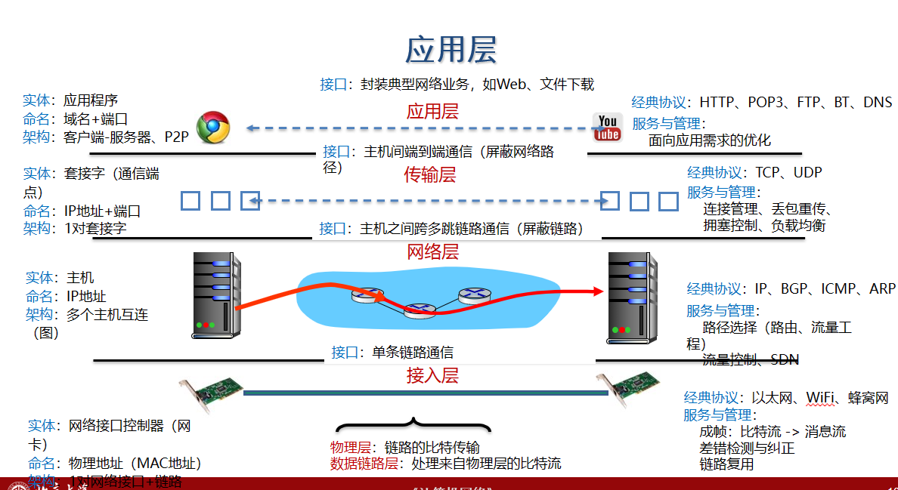

- 协议是“水平”的，接口是“垂直”的
- 实体使用协议来实现其定义的接口
- 上层实体通过接口调用下层实体

- 交换机：物理层与数据链路层功能
- 路由器：实现前3层功能 物理层 数据链路层 网络层

现代交换机与路由器已经不做区分

- 都支持二层与三层转发
- 大部分技术资料中，两个名字混合使用

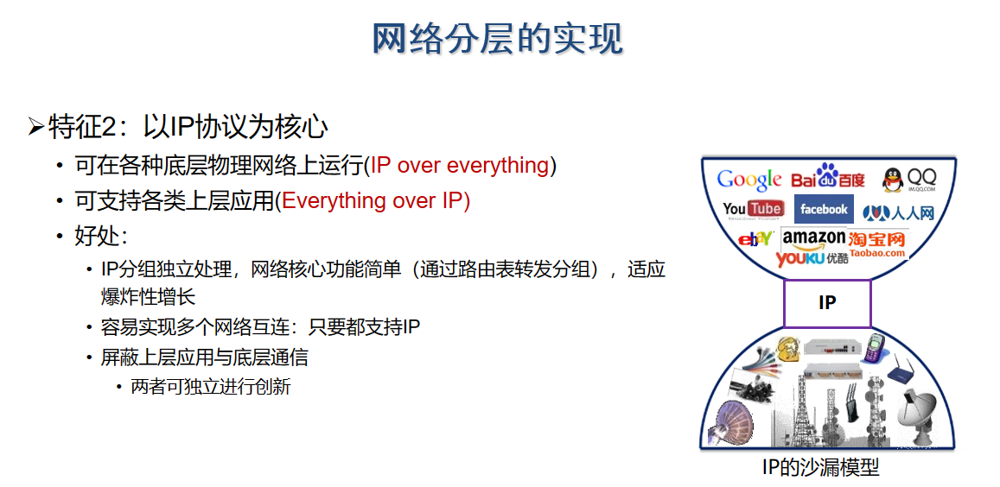

应用层的通信实体是**应用程序**

为每个应用以IP地址+端口号命名

# 组织架构

## Client/Server

**分类**

根据是否建立连接

- 可以是面向连接的，也可以是无连接的

- 面向连接时，C/S通信关系一旦建立，通信就是双向的，都可发送和接收数据

根据服务器进程的实现方式

- 服务器采用循环方式(iterative mode)

   一次只运行一个服务进程

  当有多个客户进程请求服务时，服务进程就按请求的先后顺序依次做出响应(阻塞方式

  面向连接的TCP与无连接的UDP都可以用

- 服务器采用并发方式(concurrent mode)
  
    可以同时运行多个服务进程
    
    每一个服务进程都对某个特定的客户进程做出响应(非阻塞方式
    
    通常只有面向连接的TCP使用

循环：前台就是小妹

面向连接的并发：找前台（主服务进程，监听端口），前台找小妹（从属服务进程）服务你。

无连接UDP只有一个套接字，无法被多个进程同时访问

## P2P

P2P进程既是客户同时也是服务器：角色对等：双性人银趴

P2P

每个实体都是一个对等结点 (peer)

服务:去中心化的连接与传输

- 不需要长期在线服务器
- 任意的对等结点可以直接建立连接
- 对等结点可以随时加入或退出
- 对等结点可以变换IP地址

典型例子

- P2P文件分享 (BitTorrent)
- 视频流(PPLive)
- VolP (Skype)

避免单一中心化结点造成的性能瓶颈

P2P协议中，资源索引都是最关键的问题

- 目标:给定资源，查询拥有资源的peer
- Peer可以随时加入或者退出，也可以动态更改IP地址

1. maintained by center server (中介)

   每个peer需要连接中心化服务器
   告知:自身IP地址/拥有内容
   Alice下载文件时，先向中心化服务器查询到某个内容的拥有者Bob,然后向Bob提出请求

2. Query Flood (洪泛请求)
   每个peer独立建立索引，记录自身拥有的资源

   Peer之间形成一个图(graph)
   ·图中的边为TCP连接
   ·通常每个peer建立小于10个连接
   ·注意: peers与TCP连接形成的网络，又被成为Overlay网络，有别于IP网络
   查找资源:
   ·每个peer向邻居peer查询，如果邻居peer没有该资源，则邻居peer向自身邻居递归宣询
   一旦查询到结果，沿查询路径返回最初的查询发起者

3. 混合方法: 介于中心化索引与洪泛索引之间

   将Overlay网络组织为层次化结构

- 存在超级结点
- 每个普通结点连向至少1个超级结点
- 超级结点之间可以任意建立连接

普通结点与超级结点间，使用中心化索引

- 超级结点扮演中心化服务器
- 超级结点记录“资源->网络位置”映射
- 超级结点间采用去中心化的洪泛方式查询索引

### BitTorrent

use solution 1.

对每一个种子，维护着一个正在主动上传和下载该内容的所有其他对等用户列表(torrent)

对等方可以通过中心化的Tracker (跟踪器) 找到其他对等方

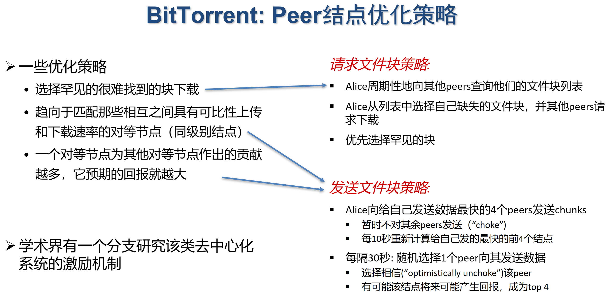

恶意节点。

### Skype

solution 3 with a login-in center server

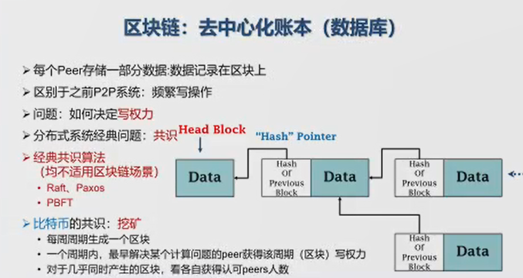

### Distributed Hash Table

If we are to void center server tracker, we need distributed hash tables, which maps key to many peers.

chord method

基本思想：

- 对所有peers地址，以及key计算哈希值
- 哈希值取模后，排列在一个圆环上
- 每个key由圆环上顺时针方向的下一个peer负责存储
- 若查询失败，则继续沿着顺时针方向查询

original method:

问题1:负载均衡
由于哈希值的不确定性，结点分布可能不均衡
问题2: Peer之间能力不一样

Solution: 将每个peer划分成更多虚拟结点

# 协议

WWW=World Wide Web=万维网

构成

- Web对象(网页，多媒体资源，动态对象与服务)，通过URL定位
- HTTP服务器和客户端
- 服务器与客户端之间执行的HTTP协议

 

动态对象指交互的，如登录操作。

## 超文本传输协议, HTTP

- HTTP为无状态协议，服务器端不保留之前请求的状态信息

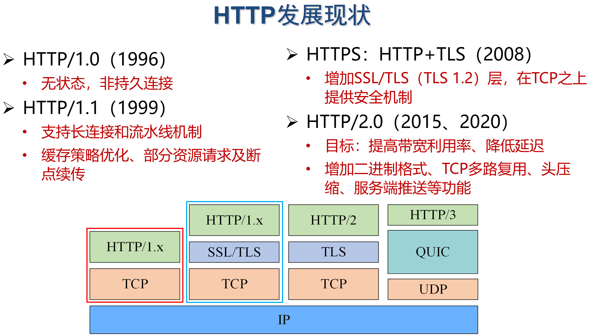

非持久连接：开一个TCP只传一个东西

持久连接：都用这个通道

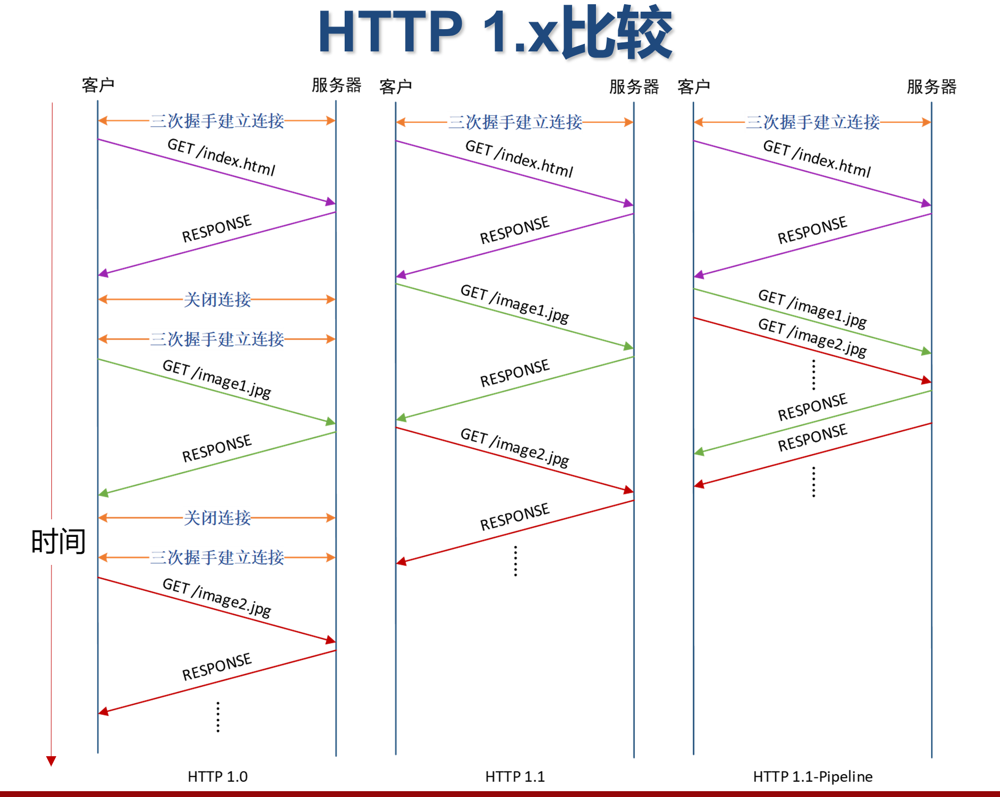

### HTTP 2

多路复用

- HTTP 1.1：一个请求的响应收到后，才能发送下一个请求
- HTTP 1.1-pipeline：可以同时发送多个请求，但要**按顺序响应**
- HTTP 2：**请求/响应允许交错**，还可以自定义优先级

压缩

HTTP 2：服务器可以主动推送消息
- 确认客户端存活
- 预测资源请求

流量控制
- HTTP 1.1：完全依赖TCP
- HTTP 2：允许应用层进行控制

### 报文结构

请求报文

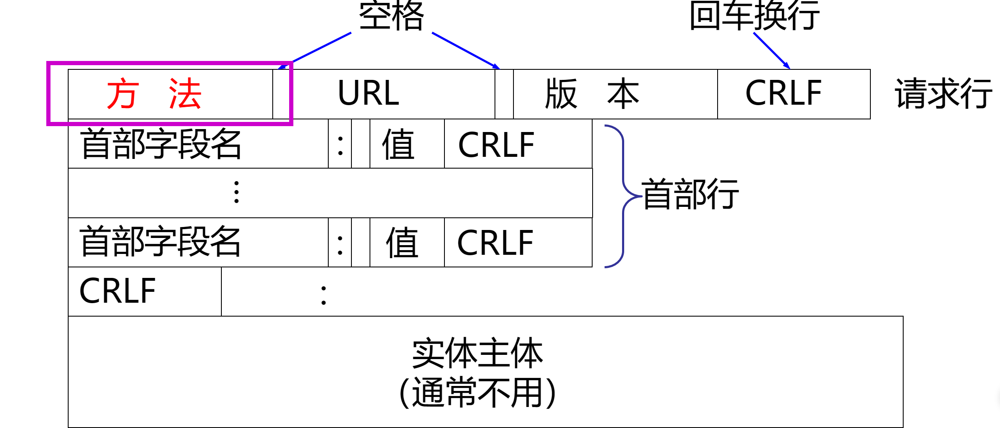

POST方法也可以用于请求URL资源
- 不同之处
- GET方法参数在请求行URL
- 通常浏览器或服务器对URL长度有限制，因此参数长度有限
- POST方法的参数在实体主体中
- 参数长度没有限制

响应报文

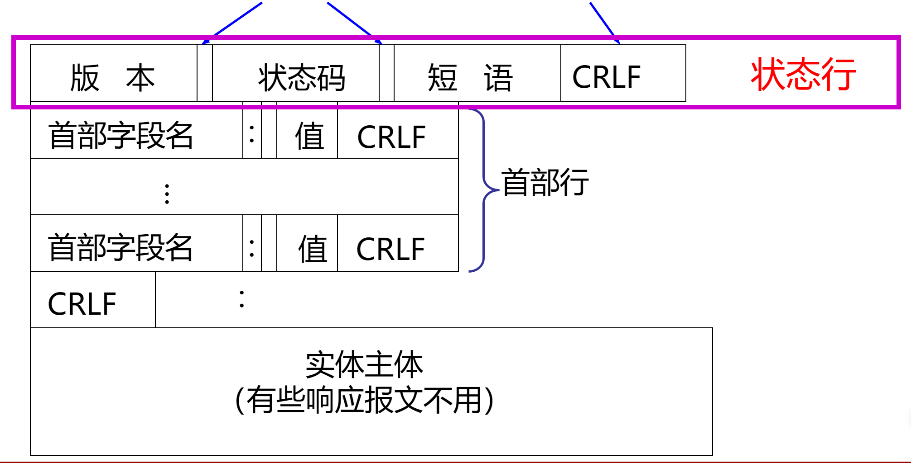

状态码

- 1xx 表示通知信息的，如请求收到了或正在进行处理。
- 2xx 表示成功，如接受或知道了。200 OK
- 3xx 表示重定向，表示要完成请求还必须采取进一步的行动。301 Moved Permanently
- 4xx 表示客户的差错，如请求中有错误的语法或不能完成。400 Bad Request, 404 Not Found 
- 5xx 表示服务器的差错，如服务器失效无法完成请求。502 Bad Gateway 505 HTTP Version not supported

### 缓存

浏览器缓存/代理服务器缓存

- 询问式策略：通过特殊的关键字头询问原始服务器，Web副本对应的原始Web页是否已更新 
- 客户端：在发送的HTTP请求中指定缓存的时间，请求头包含If-modified-since: <date>
- 服务器：如果缓存的对象是最新的
- 在响应时无需包含该对象，响应头包含HTTP/1.1 304 Not Modified，
- 否则服务器响应 HTTP/1.1 200 OK <data>

原始服务器明确指令限制缓存某些Web页
- 服务器返回Web页时，带一个no-cache禁止缓存
- 需要授权访问的Web页也限制缓存

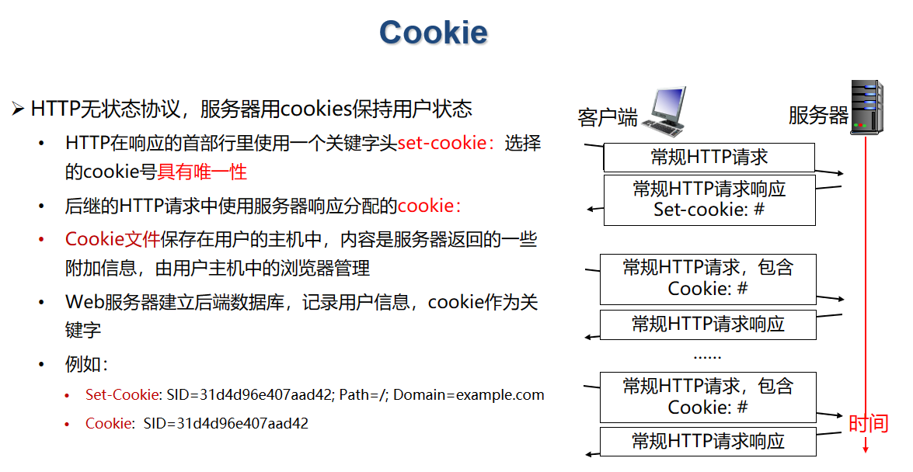

Cookie文件保存的只是文本串，没有可执行程序

# 10.9 Domain Name System, DNS

结合ics note

多个域名映射到同一IP

一台主机可能有多个名字(别名)，以便于记忆

其中一个是叫“规范名"

one domain many ip: load balance, relay optimization

二级域名字服务器

- 各个二级域名单位根据自己的具体情况把所属域名划为若干个管辖区(zone)，也可简称为区

- 每个区设置相应的权威名字服务器，用来保存该区中的所有主机的域名到IP地址的映射

  

递归查询

当收到查询请求报文的域名服务器不知被查询域名的IP地址时，该域名服务器就以DNS客户的身份向下一步应查询的域名服务器发出查询请求，即替客户端继续查询

一般在本地服务器内部采用 (load small)

迭代查询

当收到查询请求报文的域名服务器不知道被查询域名的IP地址时，就把自己知道的下一步应查询的域名服务器IP地址告诉查询者，由查询者继续向该域名服务器查询。通常本地DNS之上使用

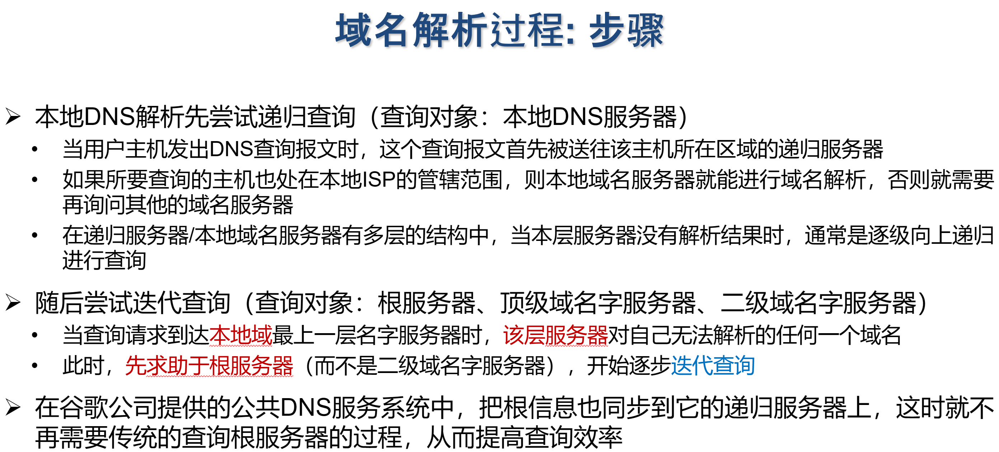

- DNS报文分为三部分：基础结构(报文首部)、问题、资源记录(RR, Resource Record)

DNS cache: valid time

缓存“域名->IP”映射

缓存顶级域名字服务器信息

# 电子邮件系统

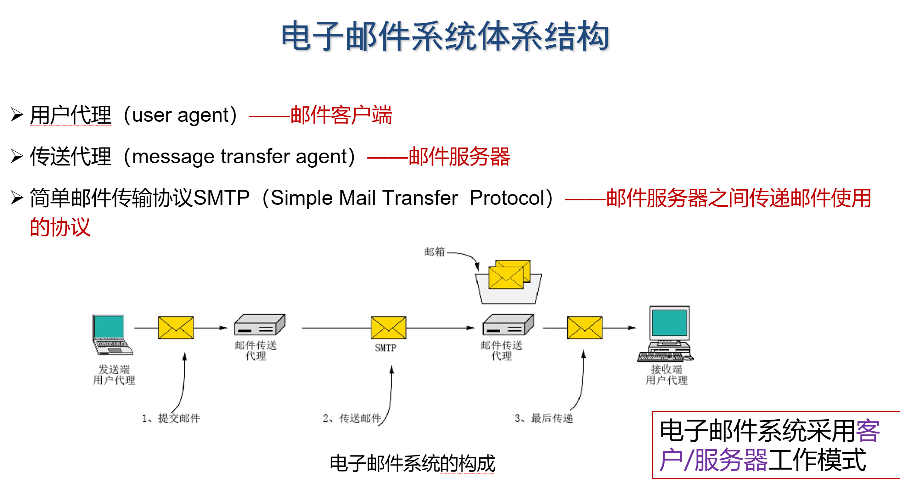

pack fetch ppt

local ethernet port is different. If you do not note that, you can capture nothing.

tcpdump: cli version of wireshark - you can get it down your local machine and use wireshark

# 10.16 流媒体

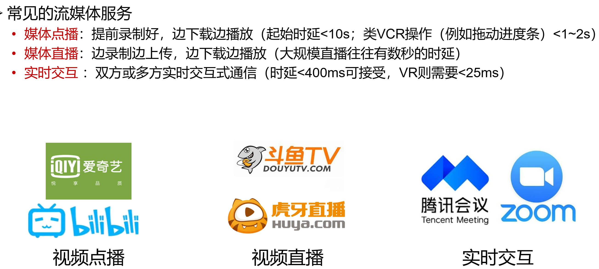

流媒体的特性

- 端到端时延约束
- 时序性约束:流媒体数据必须按照一定的**顺序**连续播放
- 具有一定程度的容错性:丢失部分数据包也可完成基本功能

网络传输后，由于网络传输的抖动特性，分组到达接收端时变成了非恒定速率；此时如果到达时就随即播放，则会出现卡顿。所以缓存了再播放

基于HTTP的协议:动态自适应传输

如何为视频块选择贴近当前可用带宽的码率?

进一步挑战:网络带宽随时间不断变化

- 信令协议，对建立的连接起控制作用，如Real-Time Streaming Protocol, RTSP(控制播放过程)
- 数据传送协议，使音/视频能够以时延敏感属性传送，如Real-Time Transport Protocol RTP(数据传输)/RTCP(Real-Time Control Protocol)与 RTP 配合使用的控制协议

