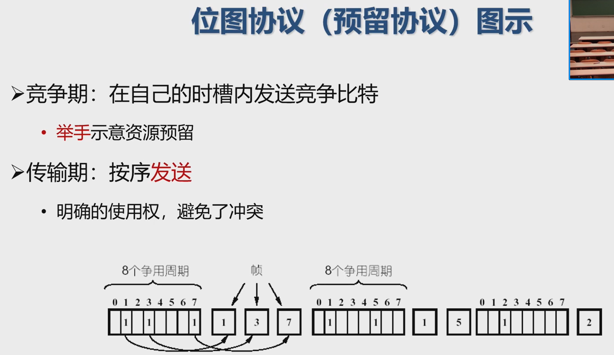

# 基本概念

向下：利用物理层提供的位流服务
向上：向网络层提供明确的(well-defined)服务接口

数据链路层的作用是在**物理相连**的两个结点间进行数据传输

术语

>主机与路由器统称为结点或站点
>连接两个站点间的物理链路: 链路或信道（有线/无线）
>一个局域网整体也可以看作一个信道
>2层数据包: 帧，封装了3层数据报文

数据链路层特点：差异性

不同链路上采用不同协议:
如第一个链路为以太网链路，中间链路为帧中继，最后一跳为802.11无线链路。

固件是可以修改的电路模块

NIC（网卡）通过数据总线(buses)接入系统，与链路层软件部分交互

# Framing

将比特流划分成“帧”的主要目的：检测和纠正物理层在比特传输中可能出现的错误，数据链路层功能需借助“帧”的各个域来实现

关键问题: 如何标识一个帧的开始?

framing的方式

字节计数法 (Byte count) for 无差错传输: 开头加一个长度

带字节填充的定界符法 (Flag bytes with byte stuffing)

定界符(FLAG):一个特殊的字节，比如 01111110，即0x7E，用于区分前后两个不同的帧

问题:如果有效载荷部分包含与“定界符”相同的字节会有什么问题? 加一个转义字节

问题:效率不高 每次转义要塞入一个Byte

带比特填充的定界符法 (Flag bits with bit stuffing )

还用0x7E 中间是六个1

问题:如果有效载荷部分包含与“定界符”相同的字节会有什么问题?

若在有效载荷中出现连续5个1比特，则直接插入1个0比特

接收方：

- 若出现连续5个1比特
- 若下一比特为0，则为有效载荷，直接丢弃0比特
- 若下一比特为1，则连同后一比特的0，构成定界符，一帧结束

物理层编码违例 (Physical layer coding violations )

核心思想: 选择的定界符不会在数据部分出现

E.g. 4B/5B编码方案

- 4比特数据映射成5比特编码，剩余的一半码字（16个码字）未使用，可以用做帧定界符
- 例如： 00110组合不包含在4B/5B编码中，可做帧定界符

# Error Control

通常采用增加冗余信息 (或称校验信息) 的策略

简单示例：每个比特传三份，如果每比特的三份中有一位出错，可以纠正。蓝牙1/3FEC采用这种方法

此处用传出层可靠传输那套开销太大。

检错码 (error-detecting code）
只能使接收方推断是否发生错误，但不能推断哪位发生错误，请求发送方重传数据
主要用在**高可靠、误码率较低**的信道上，例如光纤链路
偶尔发生的差错，可以通过重传解决差错问题

纠错码 (error-correcting code
接收方能够判断接收到的数据是否有错，并能纠正错误 (定位错的位置)

主要用于错误发生比较频繁的信道上，如无线链路

也经常用于物理层，以及更高层(例如，实时流媒体应用和内容分发，重传开销太大，希望体验顺滑)

使用纠错码的技术通常称为前向纠错(FEC，Forward Error Correction)

1位奇偶校验:增加1位校验位，可以检查奇数位错误

二维奇偶校验：检测并纠错单个比特错误

checksum in TCP/IP

## CRC 计算

- 设原始数据D为m位二进制串
- 如果要产生r位CRC校验码，事先选定一个r+1位二进制串G (称为生成多项式，收发双方提前商定)，G的最高位为1
- m+r位二进制串$D'=D<<r$ （相当于在D后面添加 r 个 0）
- CRC校验码:余数R（r位，不足r位前面用0补齐）$R=D'\underline /G$（模2除）见下图
- 接收端校验：收到<D, R>
- 将<D, R>除以G（模2除），若余数为0，则通过校验

这里的上减下就是按位异或

CRC校验能力:能检测出少于r+1位的错误，注意 不是都可以

问 D=10101 G=101 R=01 <D,R>=1010101 出两位错变成1010000 还是可以被101整除

- 码字 (code word)：一个包含m个数据位（信息位）和r个校验位的n位单元
- 描述为 (n, m) 码，n=m+r
- 码率 (code rate)：码字中不含冗余部分所占的比例，可以用m/n表示

海明距离(Hamming distance): 两个码字之间不同对应比特的数目
例:0000000000与0000011111的海明距离为5

如果两个码字的海明距离为d，则需要d个单比特错就可以把一个码字转换成另一个码字

为了检查出d个错(比特错)，可以使用海明距离为d+1的编码

为了纠正d个错，可以使用距离为2d+1的编码

检测：可错范围内没有别的可行码字

纠正：一个数据的错误偏差范围内只能有一个可行码字

# 12.11

Hamming Code

对于第k个数据位，将k分解为2的次幂之和，得到的每个2的次幂，都参与第k 位的校验，其实就是看二进制里这位有没有

对自己负责的数据进行奇偶校验

把出错的检验按二进制或一下，得到的就是错的位置

Reed-Solomon code（不考）

Galois Field arithmatic -> 不考

# 访问控制

共享信道

可能两个(或更多)站点同时请求占用信道，产生冲突 (collisions)

在多路访问信道上确定下一个使用者 (信道分配)

本质上是分布式算法

挑战:结点间协同本身也需要使用信道（没有专门用于分布式访问控制的信道）

已知广播信道速率 R bps，目标:

性能：当只有一个结点需要专输时，能够以速率R进行发送
公平：当M个结点需要传输时，每个结点发送速率R/M
去中心化：不需要结点协调传输，不需要全局时钟或者其他全局信息
简单、易实现

## 信道划分 Channel Partitioning
将信道划分为多个部分 (时间、频率、编码)

每个站点分配一个部分，进行无冲突的传输

TDMA: time division multiple access

划分出等长时间片 (长度为报文传输时间)，依次分给各个站点

FDMA: frequency division multiple access

将信道分为多个频段，每个站点分配得到1个固定的频段，每个频段带宽相同

静态分配会导致信道资源浪费

CDMA: Code Division Multiple Access

>为每个站点分配一种编码
>**即使冲突发生**，接收方也能进行解码
>主要用于无线通信(后续无线部分会讲到)

## 随机接入 Random Access
不划分信道，允许冲突；冲突发生时，进行“恢复”

当任意站点有数据要发送时
以信道带宽R全速发送
不需要事先协调

随机访问的多路信道控制、关注
冲突检测
从冲突中恢复(如:等待一段时间后重发)

信道始终处于三种状态之一
传输周期:一个站点使用信道，其他站点禁止使用
竞争周期:所有站点都有权尝试使用信道
空闲周期:所有站点都不使用信道

纯ALOHA: 想发就发

效率分析 

这里把p当作概率密度，然后给一个$[t_0,t_0+\Delta t]$的slot会比较统一。

slotted ALOHA

假设
所有帧大小一样
时间划分为等长的时间槽，每个时间槽刚好可以传输1个帧
站点只能在时间槽开始时发起传输
冲突只在时间槽起点发生
所有站点的时钟是同步的

如果发生冲突，以概率p在下一时间槽重传

### CSMA

Carrier Sense Multiple Access

特点:“先听后发
如果信道空闲，则发送
如果信道忙，则推迟发送

非持续式CSMA
特点
经侦听，如果介质空闲 开始发送

如果介质忙，则等待一个随机分布的时间，然后重复上一步骤

p-持续式CSMA

经侦听，如介质空闲，那么以p的概率立刻发送，以(1-p)的概率推迟一个时间单元再进行处理

特例：1-持续式CSMA

# 12.13

恰好同时发送/来自其他站点的传播延迟 仍可能导致CSMA的冲突。

冲突检测
(Collision Detection)

原理:“先听后发、边发边听

发送时持续侦听信道

一旦传输过程中监听到冲突，立刻中止传输，减少信道浪费

CSMA/CD 实际的CSMA/CD，特指1-持续式 +冲突检测

中止发送（检测到冲突）后，发送 Jam(强化) 信号，通知将要使用信道

冲突窗口:从发出帧到检测发现冲突所需要的最长时间

意味着发出后需要侦听一个冲突窗口才能确保没有冲突

数值上: 等于最远两站传播时间的两倍，即2D (D是单边延迟)，相当于1个来回传播延迟RTT: Round Trip Time

## 轮流协议 Taking Turns

### 轮询协议 Polling Protocol

选择一个主节点，由主节点给其他站点分配信道使用权

问题
轮询本身占用带宽
通知引入延迟
单点故障

### 令牌传递

令牌:发送权限
只有获得令牌的站点可以发送数据
令牌通过特殊的令牌消息进行传递

令牌的运行
一个站点获取到令牌后，就可以发送帧，然后把令牌交给下一个站点
如果没有帧要发，直接传递令牌

缺点

- 令牌的维护代价
- 令牌本身的可靠性

### 位图协议

无法考虑优先级

### 二进制倒计数协议

编序号，序号长度相同 的二进制串

从高位到低位，每次看一个位是否有信号来判断是不是有人比自己大

信道利用率
$$
d/(d+N\log N)
$$

有限竞争协议利用竞争协议和无冲突协议的优势
在低负荷时:使用竞争法，以减少延迟时间
在高负荷时:使用无冲突法，以获得高的信道效率

# 有线局域网络

网络层的子网概念: 有相同网络地址的接口组成的网络

局域网:不需要网络层技术，就可以传输数据的网络

虽然定义不同，但实际上，局域网 = 子网

MAC地址(局域网地址或物理地址)
功能:物理上相连的网络接口之间收发帧
大部分不可修改:烧录在网络接口控制器(NIC) 硬件上
48位:例如1A-2F-BB-76-09-AD

类比
MAC地址:身份证号
IP地址: 通信地址

如何根据MAC地址传输数据?

## Ethernet

最小帧长 =46+18 = 64B

以太网规定最短有效帧长为 64 字节，凡长度小于64字节的都是由于冲突而异常中止的无效帧

如果发生冲突，就一定是在发送的前64字节之内

由于一检测到冲突就立即中止发送，这时已经发送出的数据一定小于64字节

无效MAC帧（直接丢弃）

- 数据字段的长度与长度字段的值不一致；
- 帧的长度不是整数个字节；
- CRC检验出错；
- 数据字段的长度不在 46 ~ 1500 字节之间。

以太网：无连接、不可靠、用CSMA/CD

Metcalfe's Law

# 12.18

CSMA/CD

理想的交换机是透明的

- 即插即用，无需任何配置
- 网络中的站点无需感知交换机的存在与否

MAC地址表（MAC地址->端口）的构建-逆向学习**源地址**

每个留300s，再收到就更新

表里有 端口不同 forwarding

端口一样 filtering（忽略）

表里没有/广播帧 flooding 从所有端口(除了入境口)发送出去：一个网段的数据被发送到无关网段，存在安全隐患
浪费网络资源

交换模式

1. 存储转发模式(Store and Forward)

   特点: 转发前必须接收整个帧、执行CRC校验
   缺点:延迟大
   优点:不转发出错帧

2. 直通模式(Cut-through)

   特点:一旦接收到目的地址，就开始转发
   缺点:可能转发错误帧
   优点: 延迟非常小，可以边入边出

3. 无碎片模式(Fragment-free)

   现在主要用这种

   特点: 接收到帧的前64字节，即开始转发
   缺点: 仍可能转发错误帧
   优点: 过滤了冲突碎片，延迟和转发错帧介于存储转发和直通交换之间

## 虚拟局域网

动机

问题1:为每一组用户建立各自局域网，但不添置新交换机

问题2:为每一组用户建立各自广播域
ARP，DHCP，未知MAC地址都会产生广播。
安全/隐私要求
性能要求

可以通过配置交换机，在一套物理交换机设备上，运行多个虚拟局域网 (VLAN)
每个虚拟局域网，有一个单独的广播域

1. 基于端口分类，交换机多记一张VLAN Table。用的最多

   好处1 - 流量隔离: 发往端口1-8 的帧最终只能到达端口1-8
   好处2 - 动态配置:可以动态变更端口属于哪个VLAN

   VLAN之间的数据传输 通过网络层路由(如同2个独立局域网之间)

   但是现在的设备同时支持交换机和路由器

2. 基于MAC地址的VLAN：维护一个MAC->所属VLAN的映射

3. 基于协议 需要主机的参与。

4. 基于子网的VLAN 一个子网就是一个VLAN

# 12.20 无线网络

无线主机：无线并不意味着移动（切换了连接的基站）

基站：通常与有线网络连接，主要功能:中继(relay)

- 在有线网络与无线主机之间互相传输报文
- 有覆盖范围限制
- 例:无线信号塔，WiFi接入点

无线链路

需要多路访问控制，以协调各个主机对链路的访问

各类链路传输速率，支持距离差异很大

类型1:基于基础设施的无线网络
特点:使用基站连向更大的网络
切换 (handoff) 问题: 设备移动，导致所连接的基站发生变化

类型2:自组织网络

没有基站，节点自我组织成一个网络

- 节点只能在无线链路的覆盖范围内互相连接
- 相互路由、交换

单跳和多跳只看 经过几个无线链路

移动 (mobility) :处理主机所连基站发生的变动

- 定位主机
- IP地址
- 保持TCP连接

## 无线链路

干扰、多传播线路、信号渐弱

信噪比（signal-to-noise ratio，SNR）：收到信息强度与噪声强度的相对值

- 单位：分贝
- 信噪比越高，越容易提取信息

比特差错率（BER）：接收方收到的错误比特的比例

无线链路中的多路访问问题

问题1: 隐藏终端
B与A可以互相听到
B与C可以互相听到
A与C之间存在障碍，无法听到对方存在，更无法知道双方在B处互相干扰

问题2: 信号衰减
B与A可以互相听到
B与C可以互相听到
A与C之间收到的对方信号极为微弱，更无法知道双方在B处互相干扰

Code Division Multiple Access (CDMA)

本质上将所有可能编码的集合划分给用户
所有用户采用同样的信道频段
每个用户拥有各自的编码机制 (称为码片 code chipping）

允许用户同时传输数据

通过编码机制的设计，尽量减少干扰的影响 (称为编码正交性

## 802.11 WIFI

网络由基本服务集(Basic Service Set，BSS) 组成

基本服务集包含

- 无线主机

- 接入点 (access point,AP): 基站的角色

  主机间通过AP进行通信；只在基础设施模式下存在

自组织模式:只有无线主机

每个无线主机在能够发送或接收网络层数据之前，必须与一个AP关联（association)

主机关联AP的过程

AP周期性发送信标帧 (beacon frame) ，包含AP的SSID与MAC地址
主机扫描信道，监听信标帧
收到多个AP的信标帧时，选择1个进行关联 没有明确的选择算法
关联时，需要身份验证(可选)、分配IP(通常用DHCP)

## 访问控制4无线 12.25

发送时不再进行冲突检测 (有别于以太网CSMA/CD）
由于信号强度衰减，发送时很难收到冲突信号

CSMA/CD: 一旦空闲，立刻发送
CSMA/CA:一旦空闲，递减计时器

预约机制

核心思想:允许发送者“预约保留”信道，而不是随机访问->避免大帧传输的冲突

自适应传输速率
根据无线主机的移动，信噪比SNR发生变化
基站与无线主机都将动态调整传输速率 <- 通过改变物理层的调制技术

## 蜂窝网

核心思想：通过移动电话网络提供移动数据传输

只有第一跳（从无线主机到基站）是无线的。

2G

网络架构:完全使用语音网络

3G

核心特点
语音网络核心架构不变
单独的数据网络并行运作

4G: 控制平面和数据平面分离

## 管理移动性的一般方法

进入访问网络 连接外部代理 申请转交地址

移动设备如何通信

通过路由解决：网络中路由器为移动设备的永久地址创建路由表项

通过交换路由信息创建 (标准网络路由过程)

路由表说明了该移动设备的位置 (属于哪个外部网络）

这个无法处理海量移动设备

通过代理解决
间接路由: 通信者<> 归属代理>外部代理《>移动设备
直接路由: 通信者<>外部代理<>移动设备

- 通信者一开始仍需要通过归属代理，获取移动设备的转交地址

间接

当设备从一个访问网络移动到另一个访问网络

- 在新访问网络进行注册
- 新访问网络中的外部代理通知归属代理
- 归属代理更新该设备的转交地址记录
- 后续报文使用新转交地址发往该设备

对于通信者而言，设备移动、访问网络改变、转交地址改变是透明的

- 设备与通信者的连接仍然可以保持!

三角路由问题:

- 效率低下，特别当通信者与移动设备在同一访问网络时

直接：

去向永久地址要转交地址

对通信者不透明: 通信者必须从归属代理获取转交地址

如果设备移动到其他访问网络?

