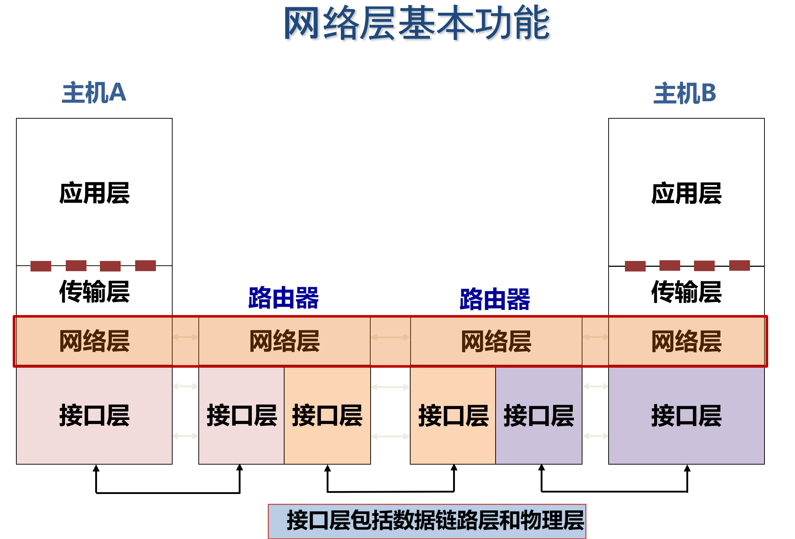
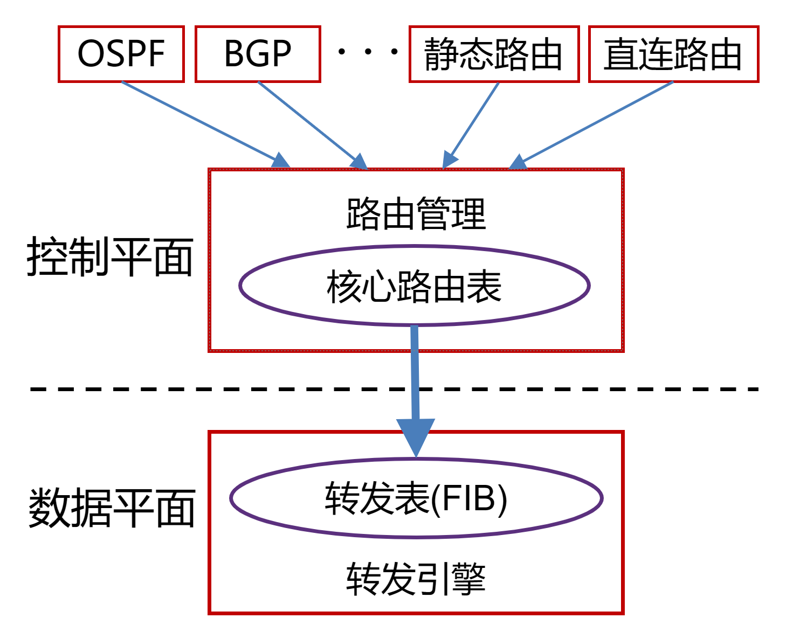
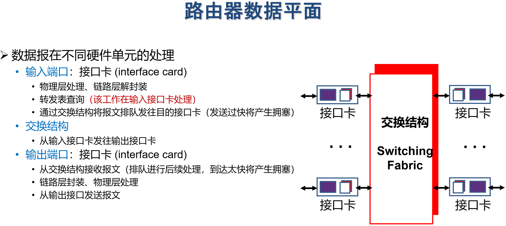
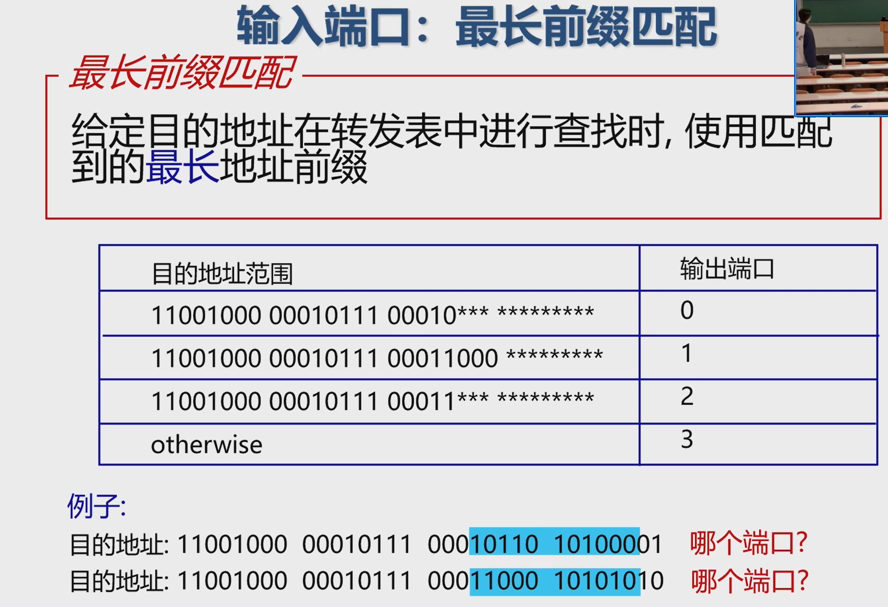
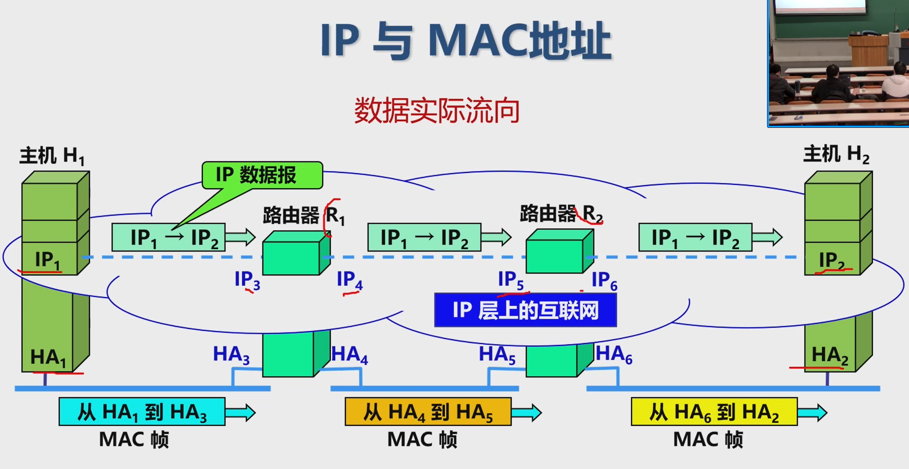
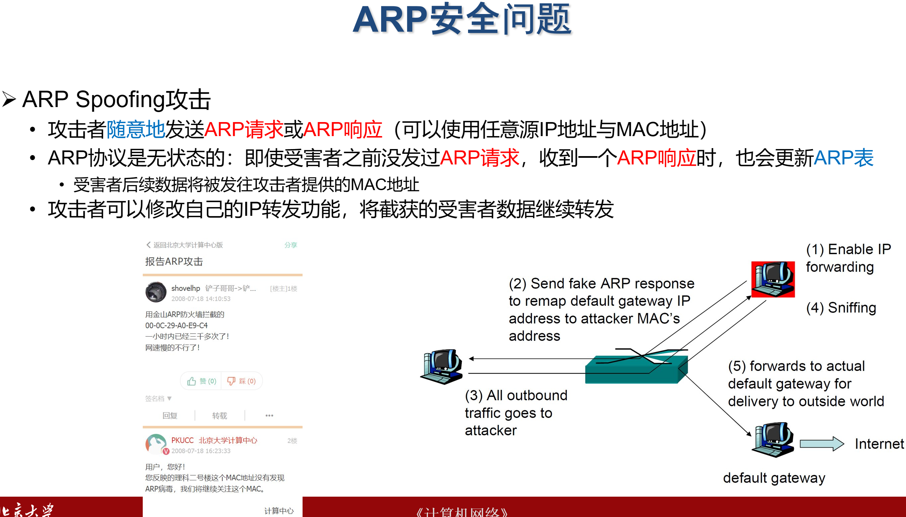
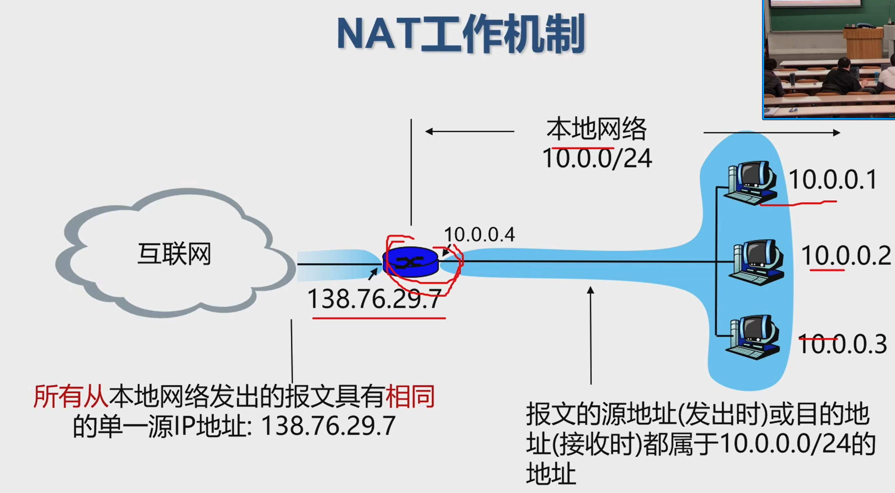
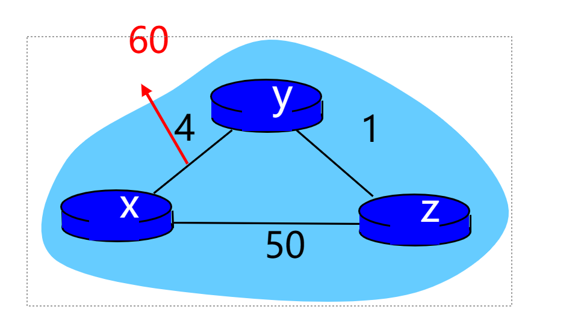

网络层负责主机间数据传输

Internet：无连接的数据报服务

无连接服务:如寄信，不需要提前建立连接

数据报服务

- 网络层向上只提供简单灵活无连接的、尽最大努力交付的数据报服务

- 发送分组时不需要先建立连接，每个分组独立发送

- 数据报独立转发，相同源-目的的数据报**可能经过不同的路径**
  网络层不提供服务质量的承诺

尽力而为交付

- 传输网络不提供端到端的可靠传输服务:丢包、乱序、错误
- 优点: 网络的造价大大降低，运行方式灵活，能够适应多种应用

无论哪种网络层服务模型，都依赖于2个核心功能
转发

- 将数据报从路由器的输入接口传送到正确的输出接口
  核心:
  转发函数
  类比:旅行时穿过一个城市(城市内部各个车站、机场移动）

路由

- 选择数据报从源端到目的端的路径
  核心: 路由算法与协议
  类比:规划出发城市到目的城市的旅行路线(城市间移动

数据平面: 转发功能

单个路由器上局部功能

每个路由器独立对收到的数据报文执行转发功能

控制平面:路由功能

- 全网计算:涉及多个路由器
- 2种实现方式
- 传统路由
  多个路由器分布式协作计算
  软件定义网络SDN
  由中心化控制器负责计算后，通知各个路由器

# 11.15 路由器

路由器可同时运行多个路由协议

路由器也可不运行任何路由协议，只使用静态路由和直连路由

用目的IP地址，基于最长前缀匹配规则查询IP转发表（IP->端口）
查询失败，丢弃报文
查询成功

- IP头部“TTL”字段值减1，重新计算IP头部“校验和
  获取转发出接口和下一跳链路层地址
  重新进行链路层封装，发送报文
- 普通IP报文转发过程中，路由器不查看传输层及以上层协议的内容

IP报文在路由器转发前后的变化

- 链路层封装更新，IP头部“TTL”减1，IP头部“校验和”更新

如果报文到达速度超过交换结构速度(如:多个输入端口往同一输出端口转发数据)
报文将在输入端口队列中缓存
缓存溢出后，丢弃后续报文

基于目的地址的转发
只根据目的IP地址
传统交换机中常用
(受限于芯片计算能力)
通用转发
可以根据数据报文中任意字段的组合

排头阻塞 (Head-of-the-Line blocking,HOL blocking)

队列中的报文，导致后续报文也需等待，即便后续报文对应的输出端口是空闲的

# 协议

### IPv4

数据报分片

MTU (Maximum Transmission Unit)，最大传输单元

链路MTU

路径MTU(Path MTU = $\min_a\{MTU_a\}$, where a is a link of this path)

分片策略

- 允许途中分片:根据下一跳链路的MTU实施分片
- 不允许途中分片:发出的数据报长度小于路径MTU (路径MTU发现机制)
重组策略
- 途中重组，实施难度大大
- 目的端重组 (Internet采用的策略
- 重组所需信息:原始数据报编号、分片偏移量、是否收集所有分片

IPv4分组在传输途中可以多次分片
源端系统，中间路由器
无论是否途中分片，IPv4分片只在目的IP对应的目的端系统进行重组

# 11.20

接口(interface): 连接主机/路由器与物理链路之间的模块
路由器有多个接口
每个主机通常有1-2个接口
**IP地址按接口分配**

IP地址的书写采用点分十进制记法，其中每一段取值范围为0到255

IP地址=网络地址+主机号

子网掩码(subnet mask )，与IP地址一一对应，是32 bit 的2进制数，置1表示网络位，置0表示主机位

子网：有相同网络地址的网络接口

子网内的接口可以不需要网络层路由就可以**通过链路层技术**进行数据传输

子网划分将一个网终块进行划分以供多个内部网络使用，使得网络的组织更加灵活、便于维护和管理

子网由接口组成，与主机/路由器等设备无关

- 一个子网内的接口，可能来自不同设备
- 一个设备的多个接口，可能属于不同子网

IP特殊地址（不考）

| 地址                                                         | 用途                                                         |
| ------------------------------------------------------------ | ------------------------------------------------------------ |
| 全0网络地址                                                  | 只在系统启动时有效，用于启动时临时通信，又叫主机地址         |
| 网络127.0.0.0/8                                              | 指本地节点(一般为127.0.0.1)，用于测试网卡及TCP/IP软件，这样浪费了1700万个地址 |
| 全0主机地址                                                  | 用于指定网络本身，称之为网络地址或者网络号                   |
| 全1主机地址                                                  | 用于广播，也称定向广播，需要指定目标网络                     |
| 0.0.0.0                                                      | 指任意地址                                                   |
| 255.255.255.255                                              | 用于本地广播，也称有限/受限广播，无须知道本地网络地址        |

子网拥有主机数量
$2^n-2=62 (n=6)$, 减去全0和全1主机地址

CIDR (Classless Inter-Domain Routing）
网络地址可以是任意长度
表示:将32位的IP地址划分为前后两个部分，并采用斜线记法，即在IP地址后加上“”，然后再写上网络前缀所占位数

### ARP

功能：获取**子网内IP-MAC映射**

这个在链路层

硬件地址，即MAC地址

如果A的ARP表中未缓有B的IP地址与MAC地址的映射关系，则A广播包含B的IP地址的ARP query

B接收到ARP query分组后，将自己的MAC地址发送给A

A在ARP表中缓存B的IP地址和MAC地址的映射关系，超时时删除

### DHCP

主要目的：自动配置ip地址

实现在应用层

动态分配ip地址

- DHCP 客户从UDP端口68以广播形式向服务器发送发现报文 (DHCP DISCOVER)​
- DHCP 服务器广播或单播发出提供报文（DHCP OFFER）
- DHCP 客户从多个DHCP服务器中选择一个，并向其以广播形式发送DHCP请求报文（DHCP REQUEST）
- 被选择的DHCP服务器广播或单播发送确认报文（DHCP ACK）

DHCP Starvation

Rogue DHCP attack

### Net Address Translation, NAT

解决IPv4地址不足的问题，是一种将私有 (保留)地址转化为公有IP地址的转换技术

- NAT转换表：每个 (源IP地址, port #)到(NAT IP地址, 新port #) 映射项

NAT的优势
节省合法地址，减少地址冲突
灵活连接Internet
保护局域网的私密性

问题或缺点
违反了IP的结构模型，路由器处理传输层协议
违反了端到端的原则
违反了最基本的协议分层规则
不能处理IP报头加密
新型网络应用的设计者必须要考虑NAT场景
如P2P应用程序

### ICMP

互联网控制报文协议
·ICMP允许主机或路由器报告差错情况和提供有关异常情况的报告
由主机和路由器用于网络层信息的通信
·ICMP 报文携带在IP 数据报中: IP上层协议号为1
CMP报文类型
·ICMP 差错报告报文
·终点不可达:不可达主机、不可达网络，无效端口、协议
·ICMP 询问报文
·回送请求/回答(ping使用)

如何利用Ping命令返回的TTL值(报文剩余跳数)，来判断对方主机操作系统的类型?

subinsb.com

Traceroute

>源向目的地发送一系列UDP段(不可能的端口号)
>
>第一个 TTL=1
>第二个 TTL=2, etc
>
>当第n个数据报到达第n个路由器
>
>路由器丢弃数据报,并向源发送一个ICMP报文(类型 11编码0
>
>报文的源IP地址就是该路由器的IP地址

# 网络路由

所有的源节点到一个指定目标节点的最优路径的集合构成一棵以目标节点为根的树，称为汇集树 (sink tree)

应用经典算法时，还需要考虑现实情形

- 简单性:每台路由器计算与存储资源有限
- 异步性:各个路由器独立、异步工作
- 鲁棒性: 网络状态不断变化，甚至可能发生结点与链路故障
- 公平性:每条路径不会过多消耗带宽等资源

全局

每个路由器都有完整的网络拓扑与链路开销等信息：链路状态算法 (基于Dijkstra算法

局部

每个路由器只知道邻居结点，以及到邻居结点的链路开销
需要结点与邻居不断交换信息，并反复迭代更新
距离向量算法 (基于Bellman-Ford算法

数据的分布式:将单机算法维护的信息分散到各个结点

计算的分布式:将算法更新操作分散到各个结点

## Distance Vector Algorithm

每个结点x维护信息

到达每个邻居结点v的开销: c(x,v)

每个邻居结点v的距离向量

距离向量 (DV):该结点x到网络中所有其他结点y的最小代价的估计

迭代:更新自己的DV  如果变了，向邻居发送DV

每次某个结点上的迭代有2种触发

本地链路代价发生改变

收到来自邻居的DV更新

结点探测到链路代价改变：代价变小时重新收敛快，变大的会慢（无穷计数）

z->x是经过y的 而y不知道

>毒性逆转 (poison reverse) 方法
>如果某结点a到达c的下一跳为b，则a将通知b:$D_a(c) =\inf$

只能管一跳

## Link State

链路向量很好，但是实现麻烦。

1发现邻居，了解他们的网络地址
2.设置到每个邻居的成本度量,
3.构造一个分组，分组中包含最新的链路信息
4.将此分组发送给其他的路由器
5.计算到其他路由器的最短路径

# 11.27

层次路由 <- 过于庞大的路由表存储、查找困难，路由信息交互开销高

现实情况:

- 地址分配往往是不连续的，难以进行高效的地址聚合
- 每个网络的网络管理员有自己的管理方法和思路，并不希望每个路由器都干涉本网络内部的地址分配等问题

外部网关协议EGP:目前使用的协议就是BGP
边界网关协议BGP (Border Gateway Protocol)
目前互联网中唯一实际运行的自治域间的路由协议
BGP功能
eBGP:从相邻的AS获得网络可达信息
iBGP:
将网络可达信息传播给AS内的路由器
基于网络可达信息和策略决定到其他网络的“最优”路由

路径通告：

BGP会话: 两个BGP路由器通过TCP连接交换BGP报文
通告到不同网络前缀的路径，即路径向量协议
“我是XX，我可以到达YY (某个网络地址)，
只要把报文发给我的边界路由器ZZ
路径向量:由一系列AS组成的序列

AS间策略与实际情况有关

AS内策略实际常用:“热土豆(Hot Potato)策略
选择最近的BGP出口，即最小化报文在本AS停留时间

# 11.29

广播路由

flooding 将每个进入数据包发送到除了进入线路外的每条出去线路

保证性:一种有效广播手段，可确保数据包被传送到网络中每个节点
容错性:即使大量路由器被损坏，也能找到一条路径(如果存在)
简单性:仅需知道自己的邻居

环路可能导致广播风暴

节点需要跟踪已泛洪的数据包以阻止洪泛
即使利用跳数来限制，也会出现成倍爆炸

序号控制泛洪 (sequence-number-controlled flooding)

来过 丢弃，没有 其它端口都发

逆向路径转发 (reverse path forwarding, RPF)

假设R的路由表中表示了到达各网络的最优路径
1 广播数据包X从接口1到达路由器R
2 R查看数据包来源S，比对R的路由表
3 X是从源头的端口来的吗?
是->X是从最佳路径来的，向其它接口转发
否->X是重复包，丢弃
不能完全避免重复分组!

生成树(spanning tree)

只在MST上转发

组播(multicasting): 源主机给网络中的一部分目标用户发送数据包

IGMP (Internet Group Management Protocol) 知道功能就行
主机可以加入或者退出组播组
路由器查询该子网的组播组成员

源点树：每个源一个spanning tree

核心树：选择一部分结点作为核心，所有流量先汇聚到核心，再进行分发

可能无法达到最优

隧道
(tunneling):可以使多播数据报穿越不支持多播的网络

选播 Anycast

将数据包传送给最近的一个组成员
在有多个服务器的情况下，用户希望快速获得正确信息，而不在乎从哪个服务器获得

# Software Define Network

流量工程:根据对传输流量的预测，规划流量的传输路径

- 目的:提高带宽利用率、避免拥塞
  通常需要线性规划、网络流算法
  基于最短路的路由:对单个路由器局部最优，但未必全局最优

Feature:

1. “基于流表(flow table)”的通用转发(如OpenFlow接口)
2. 控制平面与数据平面分离
3. 中心化控制平面
4. 应用程序可编程开发: routing, access control, load balance, etc.

## 数据平面

流表与通用转发

每个路由器维护一张流表 (flow table)，流表由控制器计算后写入每个路由器

OpenFlow的流表项由4部分组成

- 模式:报文头中的匹配值

- 动作:对于成功匹配的报文所进行的操作，包括转发、修改、丢弃、送往控制露

- 优先级:当一个报文有多个匹乱成功顶时，定义优先顺序
- 计数器:报文数、字节数

OpenFlow局限性
匹配字段、动作固定
不支持“有状态处理“: 例，当某个IP地址在一段时间内发送过多流量，进行限流限速

P4(Programming Protocol-Independent Packet Processors): 更一般性的网络编程

## 控制平面

控制器->交换机

读状态: 控制器查询交换机状态或数据，交换机需回复
配置:控制器设置交换机相关参数
修改状态:添加、删除、修改交换机流表项
Packet-out: 控制器通过交换机某个接口，发送数据报，即流量注入

交换机->控制器

流删除:通知流表项已经删除
流表项删除由控制器触发，或者超过存货周期
端口状态:上报交换机某个状态或统计信息
Packet-in:将报文发送给控制器 (通常用于匹配失败的报文)

# 12.4

IPv6

初始动机:应付“32-bit地址空间耗尽”问题(CIDR和NAT都无法从根本上解决地址短缺问题)增加地址空间

后续动机

- 简化头部，加快处理与转发
- 提升服务质量

- 冒分十六进制，x: x: x: x: x: x: x: x
- 简化方法：每个x前面的0可省略，可把连续的值为0的x表示为“::”, 且“::”只能出现1次

2001:0DA8:0000:0000:200C:0000:0000:00A5 -> 2001:DA8:0000:0000:200C::A5

IPv6头部长度固定40字节，不允许传输途中分片(fragmentation)
所有“选项”字段都在IPv6扩展头部分 (位于头部字段后面)，通过“下一个首部”字段表明

- 下一个首部：8bit ，IPv6报头后的协议类型，可能是TCP/UDP/ICMP等，也可能是扩展头

隧道技术:2个相同类型网络的设备，跨越中间异构类型网络进行通信

将一种网络的数据包作为另一种网络的数据载荷进行封装

报文长度在传输途中增大导致分片问题->途中分片与重组对传输性能影响较大
解决方法

提前分片，需要Path MTU发现机制

# 网络服务质量 Quality of Service

## 数据包调度

到处都是同一套

- 先来先服务FCFS（First-Come First-Serve）
- 公平队列算法（Fair Queueing）
- 加权公平队列算法（Weighted Fair Queueing）
- 优先级调度（Priority Scheduling）

## 流量工程

流量整形(traffic shaping): 其作用是限制流出某一网络的某一连接的流量与突发，使这类报文以比较均匀的速度向外发送

### 漏桶算法 Leaky Bucket Algorithm

平滑网络上的突发流量

突发流量可以被整形以便为网络提供一个稳定的流量

- 到达的数据包被放在缓冲区（漏桶）中
- 漏桶最多可以容纳b bytes。如果数据包到达的时候漏桶已经满了，那么数据包应被丢弃
- 数据包从漏桶中发出，以常量速率r bytes/s 注入网络，因此平滑了突发流量

### 令牌桶算法

工作原理:

产生令牌: 

周期性的以速率r向令牌桶中增加令牌，桶中的令牌不断增多。如果桶中令牌数已到达上限，则丢弃多余令牌

消耗令牌:

输入数据包会消耗桶中的令牌。在网络传输中，数据包的大小通常不一致。大的数据包相较于小的数据包消耗的令牌要多

- 当桶中的令牌数量可以满足数据包对令牌的需求，则将数据包输出
- 否则将其丢弃

## 虚电路

虚电路表示这只是一条逻辑上的连接，分组都沿着这条逻辑连接按照存储转发方式传送，而并不是真正建立了一条物理连接

我们希望沿着这条虚电路发送的数据按序到达

不一定能完全保证数据的可靠传输，链路中的任何一个组成环节仍有可能失效，而这种失效是严重的，可能导致所有数据丢失

MPLS：虚电路的一种实现

MultiProtocol Label Switching 全称是多协议标签交换

- 思想：基于IP转发 -> 基于标签转发

“给IP 数据报加标签”其实就是在链路层的首部和IP数据报的首部之间插入一个 4字节的 MPLS 首部

标签交换路由器LSR维护一张转发表

表项含义:从入接口0收到一个入标记为 3的IP 数据报，转发时，应当把该IP数据报从出接口 1转发出去，同时把标记对换为 1

### 12.6 虚拟专用网 Virtual Private Network，VPN

建立在Internet之上

通过加密与认证机制，保持**逻辑上**的隔离

VPN的设计原则

安全性、隧道与加密、数据验证、用户验证、防火墙与攻击检测

- VPN指利用公用网络架设专用网络的远程访问技术
- VPN通过隧道技术在公共网络上模拟出一条点到点的逻辑专线，从而达到安全数据传输的目的

不考： Segment Routing 压力给到主机端

Segment: 本质是指令，表示一个路径段，指引报文去哪? 怎么去?